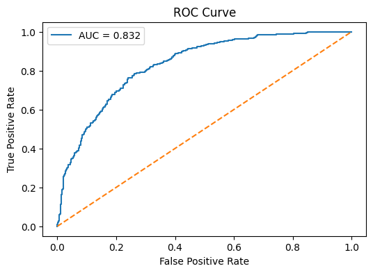
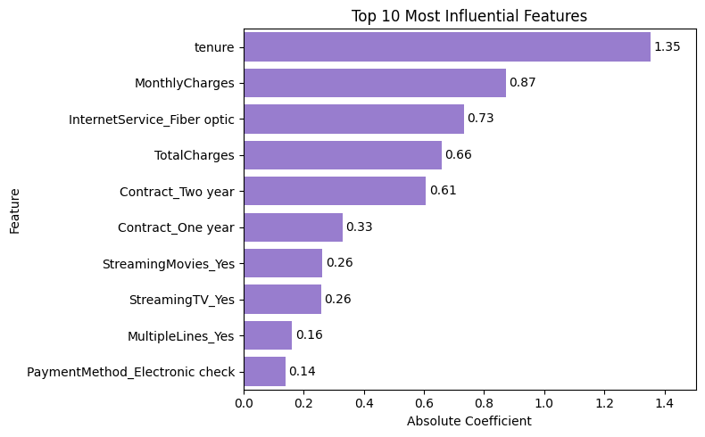

# Customer Churn Prediction Using Machine Learning

## Project Overview

Customer churn is one of the most critical challenges for subscription-based businesses. Retaining existing customers is often more cost-effective than acquiring new ones. Therefore, identifying customers who are likely to leave the company is essential for improving customer retention strategies.

The objective of this project is to analyze customer behavior, identify the key factors associated with churn, and develop machine learning models capable of predicting customer attrition.

---

## Dataset

The dataset contains customer demographic information, service subscriptions, account details, and churn status.

### Target Variable

**Churn**

- Yes = Customer left the company
- No = Customer remained with the company

### Main Features

- Gender
- SeniorCitizen
- Partner
- Dependents
- Tenure
- PhoneService
- InternetService
- OnlineSecurity
- TechSupport
- Contract
- PaperlessBilling
- PaymentMethod
- MonthlyCharges
- TotalCharges

---

## Project Workflow

### 1. Exploratory Data Analysis (EDA)

The dataset was explored to identify customer characteristics and factors associated with churn.

Key analyses included:

- Contract Type Analysis
- Payment Method Analysis
- Internet Service Analysis
- Technical Support Analysis
- Online Security Analysis
- Paperless Billing Analysis
- Monthly Charges Analysis
- Correlation Analysis

---

### 2. Data Preprocessing

The following preprocessing steps were applied:

- Removed CustomerID variable
- One-Hot Encoding for categorical features
- Train-Test Split (80%-20%)
- Feature Scaling using StandardScaler
- Class imbalance handling using Balanced Logistic Regression

---

### 3. Machine Learning Models

The following classification models were developed and evaluated:

| Model | Accuracy | Precision | Recall | F1-Score |
|---------|---------|---------|---------|---------|
| Logistic Regression | 0.79 | 0.62 | 0.52 | 0.56 |
| Balanced Logistic Regression | 0.73 | 0.50 | 0.79 | 0.61 |
| Random Forest | 0.79 | 0.63 | 0.48 | 0.54 |
| Decision Tree | 0.72 | 0.48 | 0.52 | 0.50 |

---

## Model Selection

Customer churn prediction focuses on identifying customers at risk of leaving the company. Therefore, Recall was considered the most important evaluation metric.

Although Logistic Regression and Random Forest achieved higher accuracy scores, Balanced Logistic Regression produced the highest Recall (0.79) and F1-Score (0.61).

As a result, Balanced Logistic Regression was selected as the final model.

---

## ROC-AUC Analysis

The final model achieved:

### ROC-AUC Score = 0.83

This result indicates a strong ability to distinguish between customers who churn and those who remain with the company.

### ROC Curve



---

## Feature Importance Analysis

Feature importance analysis revealed that customer churn was primarily influenced by:

1. Tenure
2. Monthly Charges
3. Internet Service (Fiber Optic)
4. Total Charges
5. Contract Type
6. Streaming Movies
7. Streaming TV
8. Multiple Lines
9. Payment Method (Electronic Check)

### Feature Importance Visualization



### Key Findings

- Customers with shorter tenure were more likely to churn.
- Higher monthly charges increased churn risk.
- Fiber optic internet users exhibited higher churn rates.
- Month-to-month contracts showed significantly higher churn rates than long-term contracts.
- Technical Support and Online Security services were associated with lower churn rates.
- Electronic Check users demonstrated the highest churn rate among payment methods.

---

## Business Recommendations

Based on the analysis results, the following actions are recommended:

- Encourage customers to switch from month-to-month contracts to longer-term contracts through loyalty programs and promotional campaigns.
- Investigate the causes of high churn among fiber optic internet customers and improve service quality where necessary.
- Promote value-added services such as Technical Support and Online Security packages.
- Monitor customers with high monthly charges and implement personalized retention strategies.
- Use the Balanced Logistic Regression model as an early warning system to identify customers at risk of churn.

---

## Technologies Used

- Python
- Pandas
- NumPy
- Matplotlib
- Seaborn
- Scikit-Learn

---

## Results

The project successfully identified key drivers of customer churn and developed a predictive model capable of detecting customers at risk of leaving.

### Final Model Performance

- Recall: 0.79
- F1-Score: 0.61
- ROC-AUC: 0.83

These results demonstrate that the model can effectively support customer retention strategies and proactive churn management.

---

## Repository Structure

```text
customer-churn-prediction/
│
├── data/
│   └── Telco_Customer_Churn.csv
│
├── images/
│   ├── roc_curve.png
│   └── feature_importance.png
│
├── Customer_Churn_Analysis.ipynb
├── README.md
├── requirements.txt
└── LICENSE
```

---

## Author

**Yağmur Ozar**

Statistics Graduate | Data Analytics & Machine Learning 

GitHub: https://github.com/yagmurozar97-creator

